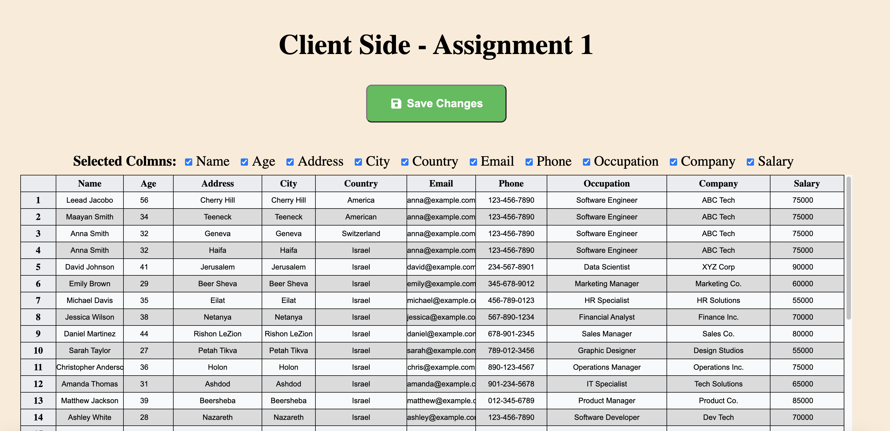

# Client Side - Assignment 1

## Overview

In this assignment, you'll be building a data table component using JavaScript and the React framework. This assignment is designed to test your coding abilities, logical thinking, UX/UI skills, and your understanding of React concepts.

## Assignment Instructions

- Build a table component to display provided data.
- The table should render different data types per column.
- Allow users to filter columns.
- Enable users to edit data directly from table cells and save the changes locally.
- The table should be optimized to render large data sets.
- Ensure the component is generic enough to be reusable with other data sets having different columns.

## Features

- Render different data types per column.
- Filter columns to show/hide specific ones.
- Edit data directly within table cells.
- Save changes locally.

## Data Shape

The data shape for the table input data is as follows:

```javascript
// TableData
{
    columns: Array<{
        id: string,
        ordinalNo: number,
        title: string,
        type: string,
        width?: number
    }>,
    data: Array<{
        id: string,
        [columnId: string]?: any
    }>
}
```

# Final Result
